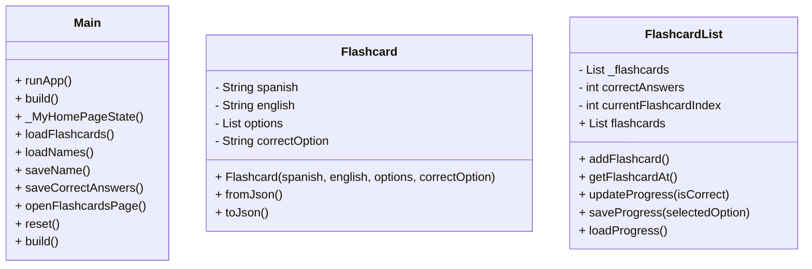

# SpanishApp

### 1. Project Introduction

The Spanish Learning App is a mobile application designed to help users learn Spanish vocabulary in an interactive and engaging way. The app uses a series of flashcards, each containing a Spanish word along with multiple-choice answers in English. The user progresses through the flashcards, marking their answers as correct or incorrect, while their progress is tracked. The app also allows users to save their progress and keep track of how many flashcards they have completed correctly.  
The target users are individuals who are beginning their Spanish learning journey and want a fun and interactive way to practice vocabulary. This app is suitable for beginners looking to improve their Spanish skills through repetition and immediate feedback. Additionally, the app allows users to track their learning progress, making it an ideal tool for those who wish to monitor their improvement over time.

### 2. Design and Architecture



### 3. Instructions

#### How to Install and Run the App
1. Clone the repository:
   ```
   git clone <repository-url>
   ```
2. Install dependencies: Navigate to the project directory and run the following command to install all necessary dependencies:
   ```
   flutter pub get
   ```
3. Run the app: After installing the dependencies, run the following command to launch the app in your preferred emulator or physical device:
   ```
   flutter run
   ```

#### How to Use
1. **Enter or select your name:**
   - You can either type your name into the provided text field or select a previously saved name from the dropdown.
   - Click **Save Name** to save your name to the list.
   
2. **Start flashcards:**
   - After saving your name, press the **Start Flashcards** button to begin the flashcards quiz.
   - Each flashcard will show a Spanish word, and you need to choose the correct translation from multiple options.
   - After answering all flashcards, your score will be displayed with the number of correct answers out of 15.
   
3. **Reset progress:**
   - To reset your progress, click **Reset Progress**, and you can start over by selecting or entering a new name.

#### Testing
To test the app, follow these steps:

- **Unit Tests:**
  - Unit tests for various functionalities such as loading and saving progress are available in the widget_test.dart file. You can run the tests by using:
    ```
    flutter test
    ```

- **Manual Testing:**
  - After running the app, manually test the features by interacting with the UI. Ensure that the flashcards are displayed correctly, answers are saved, and progress is tracked.
  - Confirm that after completing all the flashcards, the correct answers are shown, and the progress is saved.

By following these instructions, you'll be able to install, use, and test the Spanish Learning App effectively.

### 4. Challenges, Role of AI, Insights

During the development of the Spanish Learning App, one of the key challenges I faced was managing the state of the app and ensuring smooth progress tracking across multiple flashcards. Handling the user’s progress and correctly saving it while also maintaining a smooth flow from one flashcard to the next required a lot of fine-tuning. Initially, the app wasn't saving the progress accurately or updating the score in real-time. I had to refine how I handled SharedPreferences for saving user data, especially to keep track of each user's progress across multiple sessions. Another challenge was ensuring that the app could properly load flashcards from a JSON file and display them correctly, which required careful handling of data parsing and UI updates.  
AI played a crucial role in helping me overcome these challenges. I used AI for a deeper understanding of Dart and Flutter, especially when I encountered difficulties with data management, widget updates, and UI consistency. AI assisted me in catching mistakes I might have missed. AI also helped me generate code for complex tasks like managing the flashcards and saving progress, which I could then manually tweak to suit my project's needs. This process greatly accelerated the development, as it helped me focus on more complex logic and the user experience.  
Through this project, I learned a lot about GUI design and how important it is to keep the user experience simple and intuitive. I also gained more insight into the challenges of mobile programming and how to use tools like SharedPreferences for persistent data storage. The app design process made me realize the importance of usability and clarity in every component, especially when designing interactive elements like buttons and dropdown menus. AI’s role in automating parts of the code and debugging was invaluable, enabling me to work more efficiently while still learning and understanding the Dart language.

### 5. Next Steps

If I had more time, I would focus on transforming the app into a multi-user platform, allowing multiple users to save and track their progress simultaneously. Unfortunately, I wasn't able to implement this feature within the project’s timeframe. The current version of the app is a single-user application, but I see great potential in adding user authentication and storing individual progress separately for each user. This would allow users to log in, track their learning progress across different sessions, and even compete with others.  
Additionally, I would improve the app’s flexibility by integrating cloud storage for saving user progress, which would enable users to access their data across multiple devices. I would also explore adding more advanced features such as personalized recommendations based on the user's performance or incorporating audio for flashcards to help with pronunciation.
